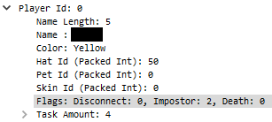

# Among Us Impostor(s) Detector


## How it works
Among Us uses plaintext UDP communication and sends all game details to every game client. The used networking library is [a fork of Hazel Networking](https://github.com/willardf/Hazel-Networking). There's also an issue with trust in this networking design, since a game client doesn't or cannot verify if a packet actually originates from the player it says it originates from, but that's out of the scope of this detector. 

This method of networking is insecure by design since a player can control his or her own environment and network. Just because the Among Us client chooses not to display certain information does not mean that we can't access it. 

This detector script parses application packets created by [Cybershard's wireshark lua plugin](https://github.com/cybershard/wireshark-amongus) to find the UpdateGameData (RPC=30) packet that is broadcasted at the start of every game containing, among other things, who the impostor(s) of the match will be.



## Installing
This Python 3 module requires [Wireshark or tshark](https://www.wireshark.org/) to be
installed on the system with the following Lua plugin installed:
https://github.com/cybershard/wireshark-amongus.

After Wireshark and the Lua plugin are installed, clone this repository and
install pyshark with pip.
```shell
git clone https://github.com/lesander/amongus-impostor-detector.git
cd amongus-impostor-detector/
pip install -r requirements.txt
```

## Usage
This module ships with a simple command line interface. See the below
examples for reference.

Use `tshark -D` to find the interface you want to listen to. Note that
on Windows, interface names **do not** need to be escaped using `\\` or quotes.

```shell
# listen to live interface eth0
python cli.py --method=live input=eth0

# parse given pcap file
python cli.py --method=file input=path/to/file.pcapng

# use verbose option for quicker results in live capture
python cli.py --method=live --input=eth0 --verbose

# listen to a live windows adapter
python cli.py --method=live --input=\Device\ABC_{12345678-1234-5678-1234-123456789012} --verbose
```

This module can also be used programmatically.

```python
from detector import Detector
detector = Detector()

# start live capture on interface eth0
detector.start_live_capture(interface='eth0')

# parse given pcap file
detector.start_file_capture(filepath='path/to/file.pcapng')

# get found impostor(s)
print(detector.get_impostors())
```
